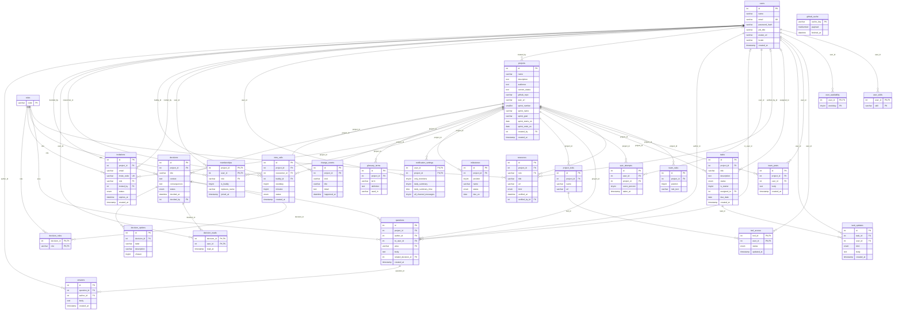

# Ramp-Up — Entity Relationship Diagram

```mermaid
erDiagram
    decisions ||--o{ decision_options : "decision_id"
    decisions ||--o{ decision_reads : "decision_id"
    decisions ||--o{ decision_roles : "decision_id"
    decisions |o--o{ questions : "related_decision_id"
    projects ||--o{ change_events : "project_id"
    projects ||--o{ decisions : "project_id"
    projects ||--o{ glossary_terms : "project_id"
    projects ||--o{ intro_calls : "project_id"
    projects ||--o{ invitations : "project_id"
    projects ||--o{ memberships : "project_id"
    projects ||--o{ milestones : "project_id"
    projects ||--o{ notification_settings : "project_id"
    projects ||--o{ project_tools : "project_id"
    projects ||--o{ questions : "project_id"
    projects ||--o{ quiz_attempts : "project_id"
    projects ||--o{ resources : "project_id"
    projects ||--o{ tasks : "project_id"
    projects ||--o{ team_posts : "project_id"
    projects ||--o{ team_rules : "project_id"
    project_tools ||--o{ tool_access : "tool_id"
    questions ||--o{ answers : "question_id"
    roles ||--o{ decision_roles : "role"
    roles ||--o{ invitations : "role"
    roles ||--o{ memberships : "role"
    roles ||--o{ questions : "area"
    roles ||--o{ resources : "role"
    tasks ||--o{ task_updates : "task_id"
    users ||--o{ answers : "author_id"
    users |o--o{ decisions : "decided_by"
    users ||--o{ decision_reads : "user_id"
    users ||--o{ intro_calls : "newcomer_id"
    users ||--o{ intro_calls : "buddy_id"
    users |o--o{ invitations : "invited_by"
    users ||--o{ memberships : "user_id"
    users ||--o{ notification_settings : "user_id"
    users |o--o{ projects : "created_by"
    users ||--o{ questions : "author_id"
    users |o--o{ questions : "to_user_id"
    users ||--o{ quiz_attempts : "user_id"
    users |o--o{ resources : "verified_by_id"
    users |o--o{ tasks : "assigned_to"
    users ||--o{ task_updates : "user_id"
    users ||--o{ team_posts : "user_id"
    users ||--o{ tool_access : "user_id"
    users ||--o{ user_availability : "user_id"
    users ||--o{ user_skills : "user_id"
    answers {
        int id PK
        int question_id FK
        int author_id FK
        text body
        timestamp created_at
    }
    change_events {
        int id PK
        int project_id FK
        varchar kind
        varchar title
        text detail
        datetime happened_at
    }
    decisions {
        int id PK
        int project_id FK
        varchar title
        text context
        text consequences
        enum status
        datetime decided_at
        int decided_by FK
    }
    decision_options {
        int id PK
        int decision_id FK
        varchar label
        varchar description
        tinyint chosen
    }
    decision_reads {
        int decision_id PK, FK
        int user_id PK, FK
        timestamp read_at
    }
    decision_roles {
        int decision_id PK, FK
        varchar role PK, FK
    }
    github_cache {
        varchar cache_key PK
        mediumtext payload
        datetime fetched_at
    }
    glossary_terms {
        int id PK
        int project_id FK
        varchar term
        text definition
        varchar used_in
    }
    intro_calls {
        int id PK
        int project_id FK
        int newcomer_id FK
        int buddy_id FK
        tinyint weekday
        tinyint minutes
        enum status
        timestamp created_at
    }
    invitations {
        int id PK
        int project_id FK
        varchar email
        varchar invite_code UK
        varchar role FK
        int invited_by FK
        enum status
        datetime expires_at
        timestamp created_at
    }
    memberships {
        int project_id PK, FK
        int user_id PK, FK
        varchar role FK
        tinyint is_buddy
        varchar replaces_name
        timestamp joined_at
    }
    milestones {
        int id PK
        int project_id FK
        tinyint position
        varchar name
        enum status
        date due_on
    }
    notification_settings {
        int user_id PK, FK
        int project_id PK, FK
        tinyint only_mentions
        tinyint daily_summary
        time daily_summary_time
        tinyint all_channel_messages
    }
    projects {
        int id PK
        varchar name
        text description
        text audience
        text current_status
        varchar github_repo
        varchar quiz_url
        smallint sprint_number
        varchar sprint_name
        varchar sprint_goal
        date sprint_starts_on
        date sprint_ends_on
        int created_by FK
        timestamp created_at
    }
    project_tools {
        int id PK
        int project_id FK
        varchar name
        varchar url
    }
    questions {
        int id PK
        int project_id FK
        int author_id FK
        int to_user_id FK
        varchar area FK
        text body
        int related_decision_id FK
        timestamp created_at
    }
    quiz_attempts {
        int id PK
        int user_id FK
        int project_id FK
        tinyint score_percent
        timestamp taken_at
    }
    resources {
        int id PK
        int project_id FK
        varchar role FK
        varchar title
        varchar url
        enum kind
        datetime verified_at
        int verified_by_id FK
    }
    roles {
        varchar code PK
    }
    tasks {
        int id PK
        int project_id FK
        varchar title
        text description
        enum status
        tinyint is_starter
        int assigned_to FK
        date due_date
        timestamp created_at
    }
    task_updates {
        int id PK
        int task_id FK
        int user_id FK
        enum kind
        text body
        timestamp created_at
    }
    team_posts {
        int id PK
        int project_id FK
        int user_id FK
        text body
        timestamp created_at
    }
    team_rules {
        int id PK
        int project_id FK
        tinyint position
        varchar rule_text
    }
    tool_access {
        int tool_id PK, FK
        int user_id PK, FK
        enum status
        timestamp updated_at
    }
    users {
        int id PK
        varchar name
        varchar email UK
        varchar password_hash
        varchar job_title
        varchar avatar_url
        varchar locale
        timestamp created_at
    }
    user_availability {
        int user_id PK, FK
        tinyint weekday PK
    }
    user_skills {
        int user_id PK, FK
        varchar skill PK
    }
```
